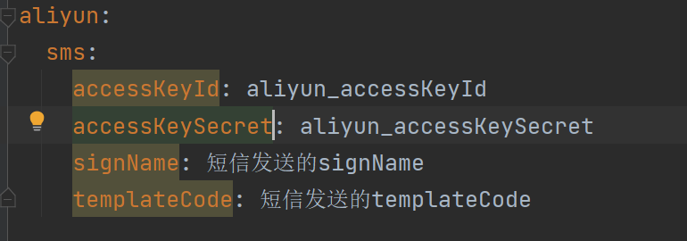
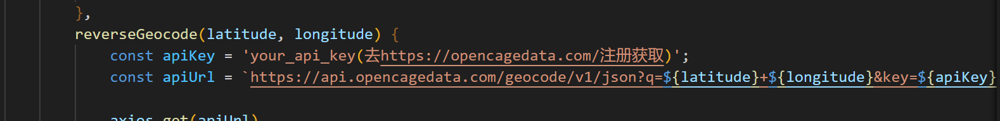
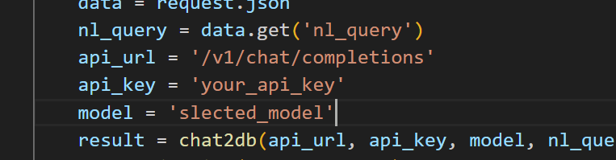
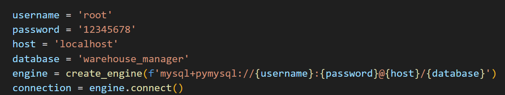

# Itelligent_warehousing_system项目概述

项目是基于SpringBoot + Vue + Python前后端分离的智能仓储系统

后端：SpringBoot + MybatisPlus + Python

前端：Node.js + Vue + element-ui

数据库：mysql

# 启动项目

## 前端（vscode）
``` bash
# 切换镜像(在此不用）
npm config set registry https://registry.npmmirror.com/

# 如需安装依赖
npm install

# 启动项目服务
npm run serve
```
## 后端

1、vscode导入chat2db文件，运行代码，启动服务

2、idea导入WarehouseManagerApi文件，启动项目

# 进行完整运行前先配置一下

### application.yml下：



### CurrentLocation.vue下：


### chatdb.py下：




# 部分演示


