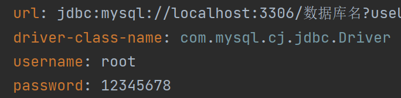

# 启动项目
``` bash
# 切换镜像
npm config set registry https://registry.npmmirror.com/

# 安装依赖
npm install

# 启动项目服务
npm run serve

# 项目概述
项目是基于SpringBoot+Vue+Python前后端分离的智能仓储系统

后端：SpringBoot + MybatisPlus + Python

前端：Node.js + Vue + element-ui

数据库：mysql

``` 
# Intelligent_warehousing_system

## 进行完整运行前先配置一下

### application.yml下：




### CurrentLocation.vue下：


### chatdb.py下：


## 演示


